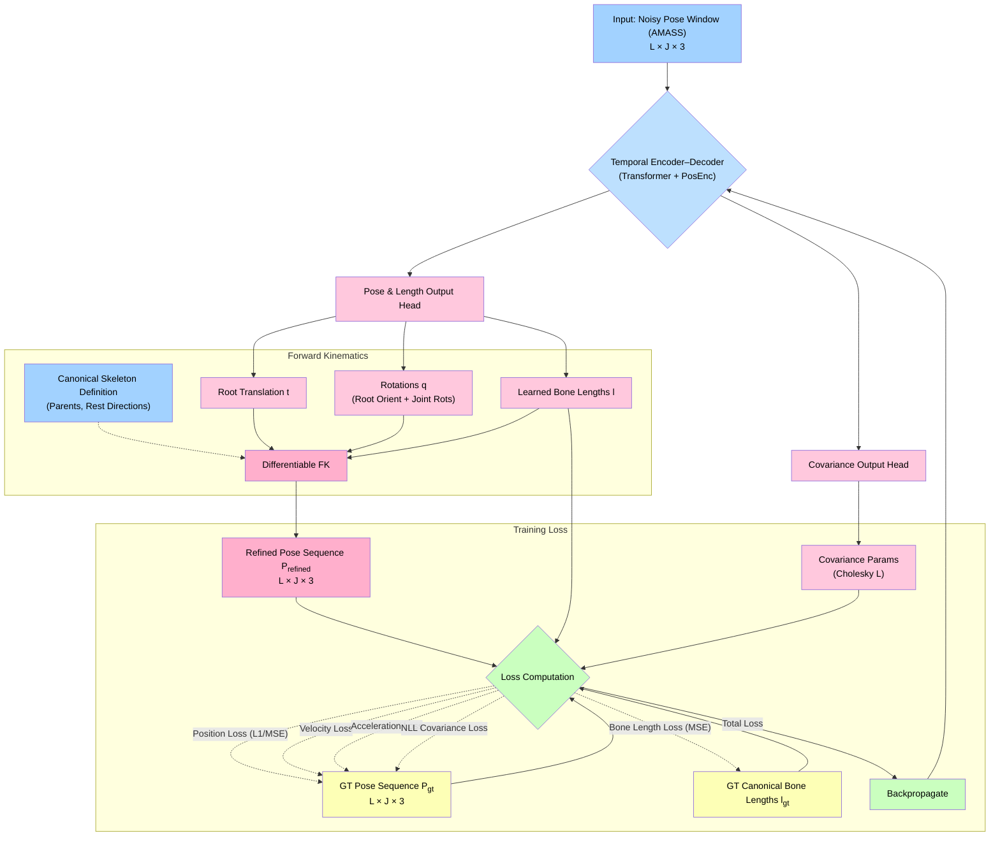

# Human Pose Smoothing with Transformer and Manifold Constraints
*A PyTorch implementation for 3D human pose smoothing using a Transformer-based temporal encoder and manifold constraints (HPSTM) to ensure physically plausible poses. Inspired by SmoothNet and ManiPose.*

Detail demo video could be found at [https://www.youtube.com/watch?v=7yrYrcs5UFk](https://www.youtube.com/watch?v=7yrYrcs5UFk)





## Overview

This repository contains a PyTorch implementation of a pose refinement model designed to take a sequence of noisy 3D human joint positions and output a denoised, temporally smooth, and physically plausible 3D pose sequence. The model leverages a Transformer-based temporal encoder to capture long-range dependencies within a sliding window of frames and employs manifold constraints by representing poses as joint rotations with fixed bone lengths. A differentiable Forward Kinematics (FK) decoder reconstructs joint positions from this latent representation, ensuring anatomically consistent outputs. This approach is inspired by the concepts presented in SmoothNet and ManiPose.

  

The core goal is to refine noisy 3D pose data (e.g., from 2D-to-3D pose estimators) by learning a low-dimensional manifold of valid human poses and applying temporal smoothing.


## Relation to the Genuine-ESFP Project

This repository, **Human Pose Smoothing with Transformer and Manifold Constraints**, constitutes the core implementation of the **Smoothing (S)** stage within our **Genuine-ESFP (Estimating, Smoothing, Filtering, and Pose-Mapping)** pipeline.

The Genuine-ESFP project ([https://github.com/Qifei-C/Genuine-ESFP](https://github.com/Qifei-C/Genuine-ESFP)) is designed for real-time monocular 3D human pose extraction and robotic imitation. The ESFP pipeline modularizes this complex task into four key stages:

1.  **E**stimate: Initial 3D joint estimation from monocular video.
2.  **S**mooth: Temporal denoising and ensuring kinematic plausibility (e.g., consistent bone lengths). **This is where the model from this repository is applied.**
3.  **F**ilter: State estimation and velocity calculation for stable control.
4.  **P**ose-Map: Mapping the refined human pose to robot degrees of freedom.

The pose smoothing model detailed herein is our advanced and enhanced solution for the "S" stage. Inspired by general-purpose smoothing techniques and the need for high physical plausibility in robotic imitation, this model employs:
* A **Transformer-based temporal encoder** to effectively capture long-range dependencies in human motion, leading to superior temporal smoothness compared to simpler filters.
* **Explicit manifold constraints**, achieved by representing poses as joint rotations with fixed bone lengths and utilizing a differentiable Forward Kinematics (FK) decoder. This rigorously enforces that all refined poses are anatomically sound and reside on the learned manifold of valid human poses.

By integrating this sophisticated smoothing module, the Genuine-ESFP pipeline benefits from highly accurate, temporally coherent, and kinematically valid pose sequences. These refined sequences are crucial for the robustness and quality of the subsequent Filtering (F) and Pose-Mapping (P) stages, ultimately leading to more natural and reliable robotic imitation.

For a complete understanding of the entire robotic imitation system, please refer to the main **[Genuine-ESFP repository](https://github.com/Qifei-C/Genuine-ESFP)**.

## Key Features & Concepts

* **Sliding Window Temporal Encoder:** Utilizes a Transformer encoder to process a sliding window of input frames, enabling the model to learn temporal smoothness and long-range dependencies, effectively reducing jitter while preserving motion dynamics.
* **Manifold-Constrained Pose Representation:** Predicts joint rotations and bone lengths, defining poses on a human skeleton manifold. This ensures anatomically consistent bone lengths and joint connectivity, avoiding physically impossible poses.
* **Differentiable Forward Kinematics (FK) Decoder:** A differentiable FK module reconstructs 3D joint positions from the predicted rotations and bone lengths. The human skeleton is modeled as a kinematic chain, and this process allows for end-to-end training.
* **Modular PyTorch Implementation:** The codebase is structured modular, with clear separation for dataset handling, skeleton definition, FK, the main pose model, and loss functions.
* **Training Strategy:** Trained on noisy pose sequences with ground-truth targets, using losses such as per-joint position error and bone-length consistency error.
* **Inference Pipeline:** Applies the trained model in a sliding-window fashion to new noisy sequences to produce smoothed outputs.

## Datasets

* **AMASS (Archive of Motion Capture as Surface Shapes):** Recommended for its diversity and high-quality 3D poses.
    * **CMU Mocap Subset:** Particularly well-suited due to its wide range of movements and numerous subjects, helping the model learn a broad pose manifold.
* **Human3.6M:** Can be used as a validation set, though it is smaller in scope compared to the CMU subset of AMASS.
* **Data Preparation:**
    * Extract 3D joint coordinates.
    * Ensure a common joint indexing and skeleton definition.
    * Compute the skeleton's rest pose and bone connectivity for FK.
    * Prepare noisy inputs by using outputs from 2D-to-3D estimators or by adding synthetic noise to ground-truth sequences.

## Installation

1.  Clone the repository:
    ```bash
    git clone [https://github.com/Qifei-C/HPSTM.git](https://github.com/Qifei-C/HPSTM.git)
    cd HPSTM
    ```
2.  Create and activate a Python virtual environment (e.g., using conda or venv).
3.  Install dependencies:
    ```bash
    pip install -r requirements.txt
    ```
    *(You will need to create a `requirements.txt` file listing packages like PyTorch, NumPy, etc.)*

## Usage

### Skeleton Definition

The model requires a skeleton definition, including parent joint indices and rest pose directions for each bone. An example 17-joint skeleton is provided in the documentation, but you should adapt this to your dataset's skeleton (e.g., from SMPL if using AMASS).

### Training

1.  **Prepare Data:**
    * Use the `src/datasets/preprocess_amass.py` script (or similar) to process your chosen dataset (e.g., AMASS CMU subset) into sequences of 3D joint coordinates.
    * Ensure data is split into training and validation sets.
    * Configure the `PoseDataset` in `src/datasets/pose_sequence_dataset.py` with your data paths, window size, and noise parameters (if using synthetic noise).
2.  **Configure Model & Training:**
    * Adjust hyperparameters in the training script (e.g., `scripts/train.py`), such as `window_size`, `batch_size`, `learning_rate`, model dimensions (`d_model`, `nhead`, `num_layers`).
    * The training script initializes the `PoseModel`, optimizer (Adam with a learning rate scheduler like `ReduceLROnPlateau` is suggested), and loss functions (position MSE loss and bone length loss).
3.  **Run Training:**
    ```bash
    python scripts/train.py
    ```
    * Monitor training and validation losses. Model checkpoints are typically saved based on validation performance.

### Inference

1.  **Load Trained Model:**
    * Initialize the `PoseModel` with the same architecture used for training.
    * Load the saved model weights (e.g., `pose_model_best.pth`).
2.  **Prepare Input Sequence:**
    * The input should be a NumPy array of shape `(T, J*3)` representing the noisy pose sequence (T frames, J joints with 3 coordinates each).
3.  **Run Smoothing:**
    * Use the `smooth_sequence` function provided in the inference script (e.g., `scripts/infer.py` or as outlined in the documentation) which applies the model in a sliding-window manner.
    ```python
    # Example usage within a script
    # model = PoseModel(...)
    # model.load_state_dict(torch.load("path/to/your/model.pth"))
    # model.eval()
    # noisy_pose_sequence = ... # Load your noisy sequence
    # refined_sequence = smooth_sequence(model, noisy_pose_sequence, window_size)
    ```
    * The output will be the refined 3D pose sequence.
4. Sample Training Code:
   Under the root of project, run: 
   ```bash
   python scripts/train.py \
    --model_type transformer --amass_root_dir "data/CMU" --val_split_ratio 0.15 --split_seed 42 \
    --checkpoint_dir "checkpoints/cmu_auto_split_run" --log_dir "results/logs/cmu_auto_split_run" \
    --run_name "cmu_transformer_auto_split_1" --skeleton_type smpl_24 \
    --window_size 31 --batch_size 32 --learning_rate 1e-4 --num_epochs 100 --device cuda --num_workers 8 \
    --gaussian_noise_std_train 0.01 --temporal_noise_type filtered --temporal_noise_scale 0.015 --temporal_filter_window 7 \
    --outlier_prob 0.005 --outlier_scale 0.25 --bonelen_noise_scale 0.03 \
    --d_model_transformer 512 --nhead_transformer 8 --num_encoder_layers_transformer 4 --num_decoder_layers_transformer 4 \
    --dim_feedforward_transformer 2048 --dropout_transformer 0.15 --use_quaternions_transformer True \
    --w_tf_loss_pose 1.0 --w_tf_loss_vel 0.75 --w_tf_loss_accel 0.5
   ```

## Implementation Details

The project is implemented in PyTorch with a modular structure:

* **`src/datasets/`**: Contains dataset loading (`PoseDataset`) and preprocessing utilities.
* **`src/kinematics/`**: Includes Forward Kinematics (`ForwardKinematics`) and skeleton definitions.
* **`src/losses/`**: Defines loss functions like position MSE loss and bone length consistency loss.
* **`src/models/`**: Contains the main `PoseModel` integrating the Transformer encoder and manifold decoder.
* **`scripts/`**: Provides scripts for training, inference, and data preprocessing.

Key components include:
* **`PoseDataset`**: Handles loading sequences and yielding sliding window samples.
* **`ForwardKinematics`**: Converts predicted rotations and bone lengths to 3D joint positions.
* **`PoseModel`**:
    * Input projection layer.
    * Learnable positional embeddings for the Transformer.
    * Transformer encoder.
    * Output heads for rotations and bone lengths.
    * Uses the `ForwardKinematics` module for the final pose reconstruction.

## References

* [1] Zeng et al. (2022). *SmoothNet: A Plug-and-Play Network for Refining Human Poses in Videos*. ([Link to paper](https://www.researchgate.net/publication/365037480_SmoothNet_A_Plug-and-Play_Network_for_Refining_Human_Poses_in_Videos), [ECCV version](https://www.ecva.net/papers/eccv_2022/papers_ECCV/papers/136650615.pdf))
* [2] Rommel et al. (2024). *ManiPose: Manifold-Constrained Multi-Hypothesis 3D Human Pose Estimation*. ([Link to paper](https://ar5iv.org/pdf/2312.06386))
* [3] Various authors on Differentiable Forward Kinematics for human skeletons.
* [4] AMASS Dataset: [https://amass.is.tue.mpg.de/](https://amass.is.tue.mpg.de/)
* [5] Human3.6M Dataset: [http://vision.imar.ro/human3.6m/](http://vision.imar.ro/human3.6m/)


